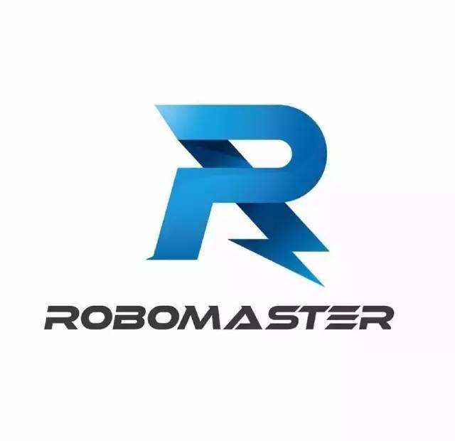

### liuhao-HDML第2讲 听课笔记

#### 基本介绍
1. HDML—超文本标记语言（HyperText Markup Language）
是一个国际标准（W3C-国际万维网组织(www.w3.org)）`eg:TCP/IP`，用于构建网页内容。

2. 三种技术：HTML、CSS、JS  围绕前端，
**浏览器**`Chrome\FireFox\Opera\Safari\IE-Edge`
网页就会产生浏览器兼容性的问题，不同的浏览器厂商不一定100%覆盖兼容W3C标准，因此我们需要做浏览器兼容性测试，
在软件公司里，可以限定用户使用那种浏览器。

3. HTML由谁来执行？——浏览器 Browser
  - B/S结构：Browser/Server(浏览器/服务器)【主流】Java做的就是B/S结构
           语言：Java、PHP、Python、ASP.NET
  - C/S结构：Client/Server (客户端/服务器) 代表：迅雷、酷狗、QQ
           语言：C++、C#(WinForm)、
  - 单机软件：eg:Office
           语言：VB、C++(VC++)、C#、Java、

#### HTML结构
1. `DOCTYPE`：表示文档类型定义，定义整个网页的根元素html
网页包含head和bady
- head中的**meta**表示元数据
- head中的**title** 表示标题
  ```
    <head></head> //标记、标签、元素
    有体标记：<head></head>...
    无体标记<br>...
  ```
2. 静态网页文件扩展名（.htm / .html 建议使用`.html`）

#### HTML开发工具
1. 美工使用的是：Dreamweaver
2. 开发者使用的：Webstorm、HBuilder
3. 文本编辑器：Notepad++、Sublime、Atom等
#### 开发常用的HTML元素
1. 标题
```
<h1>标题一</h1>
<h2>标题二</h2>
```
2. 图片
```

```
3. 超链接
```
<a href="https://bbs.robomaster.com/portal.php">RoboMaster</a>
```
4. 表格
- 行 `<tr></tr>`
- 列 `<td></td>`
- 行和列的跨度 `rowspan() colspan()`
5. 表单
- 标签`<from></from>`
- 提示：(`placeholder`(只提示)、`value`（可进行修改）)
   ```
   用户名<input placeholder="请输入用户名" type="text" name="username"><br>
   真实姓名<input type="text" value="刘浩" name="rname"><br>
   ```
- 单选按钮`<input type="radio">`
- 复选框`<input type="checkbox" checked name="love" value="play">踢球`
- 下拉列表` <option value="shanxi" selected>山西</option>`
- 提交表单`<input type="submit" value="注册"><br>`
- 重写表单`<input type="reset" value="重填"><br>`
- 默认选中`selected(适用于下拉列表中)、checked(适用于复选框、单选按钮)`
  ```
    **面试题**
    post和get区别
     - post传输数据在地址栏不显示，get是显示的(会暴漏信息)
     - post发送数据量不限，get限制为2k(不同浏览器限制不同)
     - get方式：
       【1】超链接属于get方式;
       【2】表单的method指定为get也属于get方式;
       【3】在地址栏直接输入网址敲回车;
     - post方式：
        表单的method指定为post时
     - get方式居多
  ```
6. 列表
 - 无序列表`<ul></ul>`
 - 有序列表`<ol></ol>`
7. 其他
- 段落`<p></p>`-块元素，自动换行（行间距大）
- 段落`<div></div>`-块，网页上的一个区域，自动换行（行间距小）
- 用来做提示`<span></span>/<label></label>`(不会换行)
- 空格`&nbsp;`
***
> 自行搜索：字符集（ASCII ,ISO8859-1,GB2312,GBK,Unicode,UTF-8）
　　
    首先，先科普一下什么是字符编码。字符是指一种语言中使用的基本实体，比如英文中的26个英文字母，标点符号，以及中文中的一个个汉字，都可以算做一个字符。我们在计算机屏幕上看到的这些字符，在计算机存储介质中存放的实际是二进制的比特流(...0101...)。

​    那么在这两者之间的转换就需要一个统一的标准，否则就会出现乱码(`mojibake`)。于是为了实现转换标准，各种字符集标准就出现了。简单的说字符编码就是规定了某个文字对应的二进制数字存放方式（编码）和某串二进制数值代表了哪个文字（解码）的转换关系。

  - **ASCII**：计算机最初是由美国等国家发明的，所以最初的字符编码规范是以英文为基础。录入英文字符编码标准：ASCII(American Stardard Code for Information InterChange 美国信息互换标准代码)，单字节编码，使用单字节8位 前127个存储英文字母及标点符号。

  - **ISO8859-1 / Latin-1** ：ISO(国际标准化组织)在ASCII基础上做的扩展，向下兼容ASCII，也是单字节编码，是许多欧洲国家使用的编码标准。

  - **GB2312** ：随着发展，各国都需要使用各国的语言使用计算机，相应的，我国大陆地区采用双字节 高低位字节的方式，存储简体中文。当存储中文字符时，高低位都存放大于127的数字，当读取高位字节时，若大于127，则认为是中文字符，将读取双字节进行识别，若小于127，则认为是英文字符，单字节识别。另外，GB2312在大于127位的编码库也提供了中文符号的编码，故英文标点符号称做半角符号，中文标点符号称作全角符号。

  - **GBK** ：对GB2312的拓展，双字节编码，区别是当存储中文字符时，高位存放大于127的数字，低位不再是大于127的数字，将127之前的数字也囊括了。GBK将繁体中文也囊括进来。

  - **Unicode** ：针对各个国家都使用不同的编码机制，iso(国际标准化组织)又站了出来，对全球编码做了整个的囊括，推出了Unicode ，但其字符集也是最复杂、占用空间最大的。
    Unicode，定长双字节编码，对ASCII采取高位补零的方式拓展，不兼容iso8859-1编码。
    说明： 定长编码便于计算机处理（GB2312/GBK不是定长编码），而unicode又可以用来表示所有字符，所以在很多软件内部是使用unicode编码来处理的，比如java。

  - **UTF-8** ：由于Unicode是一组编码映射，即一个字符映射一个16进制数字的形式。随着互联网发展，unicode不便于传输和存储，为了节省资源（无论是硬盘存储还是流量），相应的就产生了utf-8编码。
    UTF-8兼容ISO8859-1编码，同时也可以用来表示所有语言，不过UTF-8编码是不定长编码，一般来讲，英文字母都是用一个字节表示，而汉字使用三个字节，比 unicode编码节省空间。

    [参考连接](https://www.cnblogs.com/doudou-taste/p/9140202.html)


